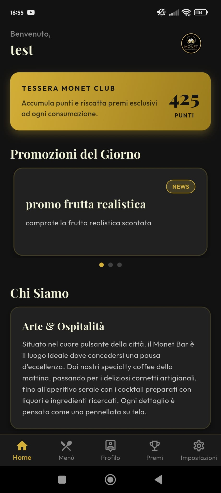
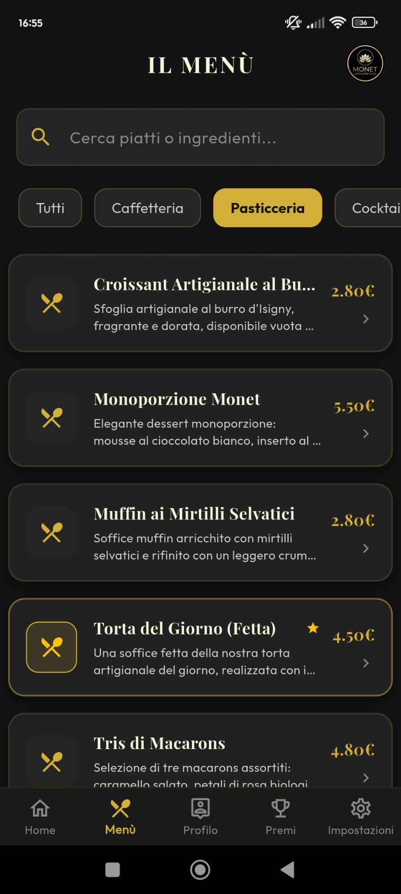
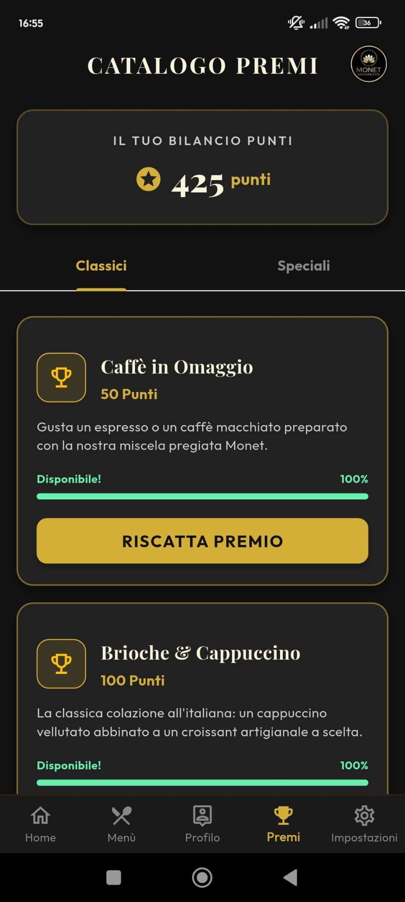

# Monet Bar

**Monet Bar** è un'applicazione mobile innovativa sviluppata in Flutter e Firebase, pensata per modernizzare l'interazione tra bar e clienti tramite un sistema digitale di fidelity card, premi e gestione del menu.

## 🌐 Prova l'App (Versione Web)
Mentre l'app non è ancora disponibile sugli store ufficiali, puoi provare la versione web (PWA) direttamente dal tuo browser a questo link:
👉 **[Clicca qui per aprire Monet Bar Web](https://monet-bar.web.app/)**
*(Nota: L'interfaccia web include le stesse funzionalità della controparte mobile).*

## 📸 Screenshot dell'App

Qui sotto puoi vedere in anteprima il design elegante e moderno dell'applicazione:

  
  
  

## 🌟 Funzionalità Principali

### 👥 Lato Cliente
* **Registrazione e Accesso:** Creazione di un profilo personale.
* **Dashboard Punti:** Visualizzazione in tempo reale dei punti fedeltà accumulati.
* **Menu Digitale:** Consultazione del menu del bar direttamente dall'app.
* **Riscatto Premi:** Possibilità di convertire i punti in fantastici premi generando un comodo codice QR dinamico.

### 👑 Lato Admin (Gestore del Bar)
* **Pannello di Controllo:** Dashboard dedicata con statistiche.
* **Gestione Punti:** Modulo integrato per accreditare o scalare punti ai clienti.
* **Gestione Catalogo:** Strumento per inserire, modificare e rimuovere i prodotti del Menu e i Premi sbloccabili.
* **Scanner QR Integrato:** Una fotocamera nell'app per scannerizzare il QR Code mostrato dal cliente per convalidare in sicurezza l'erogazione del premio e la rimozione automatica dei punti spesi.

## 🛠️ Stack Tecnologico
* **Frontend:** [Flutter](https://flutter.dev) (Dart)
* **Backend:** [Firebase](https://firebase.google.com/) (Authentication, Cloud Firestore)
* **Librerie Chiave:** 
  * `qr_flutter` per la generazione dei QR.
  * `mobile_scanner` per la lettura dei QR lato admin.
  * `google_fonts` per il design tipografico moderno e accattivante.

## 🚀 Come iniziare
1. Clona il repository.
2. Assicurati di aver configurato il tuo progetto Firebase e di avere i file di configurazione validi (`google-services.json` per Android, `GoogleService-Info.plist` per iOS).
3. Esegui `flutter pub get` per scaricare le dipendenze.
4. Esegui l'app con `flutter run` o compila la versione di release con `flutter build apk`.

## 🎨 Design
L'applicazione è caratterizzata da un tema premium "Dark Glassmorphism", con sfumature eleganti in toni di nero, ambra e oro per dare una sensazione di lusso e modernità all'utente fin dal primo accesso.
